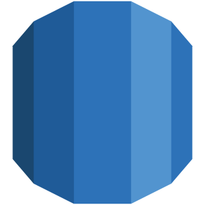

# Hi, i am Pedro Daniel 👋
 
I'm a software developer and I love to learn new things. My main focus is participate in the development new applications and services with a idea of are util for the peoples.
 
 

## Stack

 

 

 

 

 

 

 

## Dashborad

